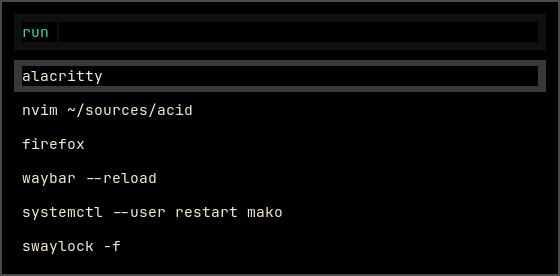
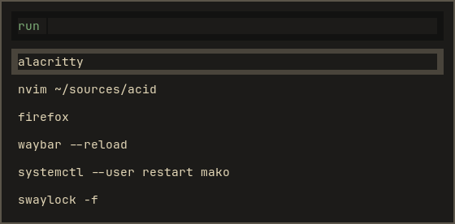

# Acid for rofi

Two flavours: **Acetic** (`#000000`), vibrant, and **Citric** (`#1c1b19`), muted.

Part of [Acid](https://github.com/acid-theme/acid), a very dark colourscheme in two
flavours. The main README lists the other ports.

## Preview

| Acetic | Citric |
| --- | --- |
|  |  |

## Install

```sh
curl -fsSLo ~/.config/rofi/acid-acetic.rasi \
  https://raw.githubusercontent.com/acid-theme/rofi/main/acid-acetic.rasi
```

The theme is the role names only. Import it and map them onto rofi's widgets:

```rasi
@import "acid-acetic"

* {
    background-color: transparent;
    text-color:       @text;
    spacing:          2;
}

window {
    background-color: @base;
    border:           1px;
    border-color:     @surface2;
    padding:          8px;
}

inputbar {
    padding:  4px;
    spacing:  4px;
    children: [ prompt, textbox-prompt-colon, entry, num-filtered-rows, textbox-num-sep, num-rows ];
}

prompt               { text-color: @aqua; }
textbox-prompt-colon { expand: false; str: ":"; text-color: @overlay1; }
entry                { placeholder: "Type to filter"; placeholder-color: @overlay1; }
num-filtered-rows,
num-rows             { expand: false; text-color: @overlay1; }
textbox-num-sep      { expand: false; str: "/"; text-color: @overlay1; }

listview {
    padding:      4px 0px 0px;
    border:       2px dash 0px 0px;
    border-color: @surface1;
    spacing:      4px;
    scrollbar:    true;
}

scrollbar { width: 4px; handle-width: 8px; handle-color: @overlay0; }

element { padding: 4px; spacing: 4px; }

element normal.normal    { text-color: @text; }
element normal.active    { text-color: @blue; }
element normal.urgent    { text-color: @red; }

element alternate.normal { background-color: @mantle; text-color: @text; }
element alternate.active { background-color: @mantle; text-color: @blue; }
element alternate.urgent { background-color: @mantle; text-color: @red; }

element selected.normal  { background-color: @text; text-color: @mantle; }
element selected.active  { background-color: @blue; text-color: @base; }
element selected.urgent  { background-color: @red; text-color: @base; }

element-text { background-color: transparent; text-color: inherit; }
```

All nine element states are worth setting: a row is `normal`, `alternate` or
`selected` crossed with `normal`, `active` or `urgent`, and an unset combination
falls back to rofi's own colours.

rofi accepts a name it does not know without complaint, so a misspelled role
leaves that widget on rofi's default rather than failing.

## Files

- `acid-acetic.rasi`
- `acid-citric.rasi`

## Generated

Acid 0.1.0, rendered by acidify from
[`ports/rofi/acid.rasi.tera`](https://github.com/acid-theme/acid/blob/main/ports/rofi/acid.rasi.tera).
Edits to these files are overwritten on the next release. Report issues on
[acid-theme/acid](https://github.com/acid-theme/acid/issues).

## Licence

MIT.
