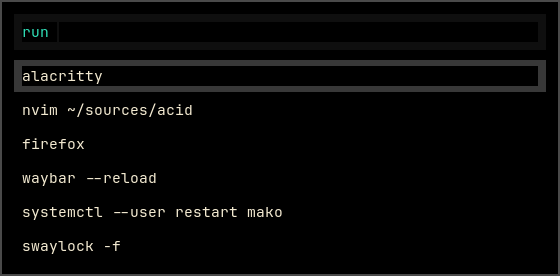
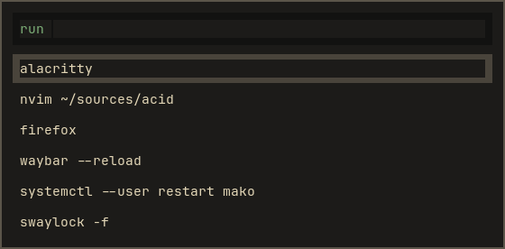
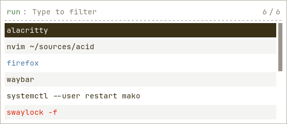

# Acid for rofi

Generated from [acid-theme/acid](https://github.com/acid-theme/acid) — open issues
and pull requests there.

<details>
<summary>Screenshots</summary>

| Acetic | Citric | Lactic |
| --- | --- | --- |
|  |  |  |

</details>

## Install

```sh
curl -fsSLo ~/.config/rofi/acid-acetic.rasi \
  https://raw.githubusercontent.com/acid-theme/rofi/main/acid-acetic.rasi
```

The theme is the role names only. Import it and map them onto rofi's widgets:

```rasi
@import "acid-acetic"

* {
    background-color: transparent;
    text-color:       @text;
    spacing:          2;
}

window {
    background-color: @base;
    border:           1px;
    border-color:     @surface2;
    padding:          8px;
}

inputbar {
    padding:  4px;
    spacing:  4px;
    children: [ prompt, textbox-prompt-colon, entry, num-filtered-rows, textbox-num-sep, num-rows ];
}

prompt               { text-color: @aqua; }
textbox-prompt-colon { expand: false; str: ":"; text-color: @overlay1; }
entry                { placeholder: "Type to filter"; placeholder-color: @overlay1; }
num-filtered-rows,
num-rows             { expand: false; text-color: @overlay1; }
textbox-num-sep      { expand: false; str: "/"; text-color: @overlay1; }

listview {
    padding:      4px 0px 0px;
    border:       2px dash 0px 0px;
    border-color: @surface1;
    spacing:      4px;
    scrollbar:    true;
}

scrollbar { width: 4px; handle-width: 8px; handle-color: @overlay0; }

element { padding: 4px; spacing: 4px; }

element normal.normal    { text-color: @text; }
element normal.active    { text-color: @blue; }
element normal.urgent    { text-color: @red; }

element alternate.normal { background-color: @mantle; text-color: @text; }
element alternate.active { background-color: @mantle; text-color: @blue; }
element alternate.urgent { background-color: @mantle; text-color: @red; }

element selected.normal  { background-color: @text; text-color: @mantle; }
element selected.active  { background-color: @blue; text-color: @base; }
element selected.urgent  { background-color: @red; text-color: @base; }

element-text { background-color: transparent; text-color: inherit; }
```

## Credits

[@ssiyad](https://github.com/ssiyad)
